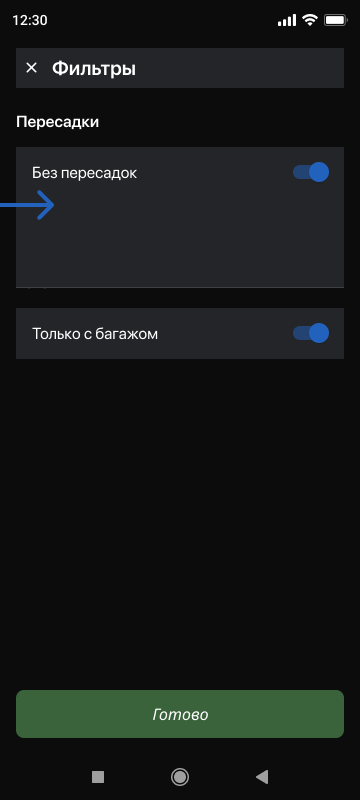

# ticket_finder

Приложение состоит из:
1. Меню
2. Главная. Первый вход
2. Поиск
3. Поиск. Выбрана страна
4. Фильтры
5. Просмотреть все билеты
6. Фильтры билетов
7. Экран билета

Технологический стэк:
- Pattern BloC(в виде библиотеки);
- Использование stateful/stateless в том или ином виде;
- Использование BloC;
- Использование Future/async/await;
- Для работы с сетью - dio.

## Начало работы

- Пользователь открывает приложение.
- Открывается главный экран с поиском билетов.
- Вводит данные для поиска. 
- Может открыть фильтр для отображения допю полей. 
- Кликает на поиск.Отображается лента билетов.
- В ленте может открыть фильтр и задать доп. настройки.
- Кликает на билет. Отображается информация по билетам.
- Свитчером добавляет или исключает багаж. Покупает билет.
  
  Эти инструкции помогут вам настроить копию проекта на вашем локальном компьютере для разработки и запуска.

### Предварительные условия

Что нужно для работы с Flutter:

- Flutter SDK
- Android Studio / IntelliJ или Visual Studio Code с установленными плагинами для Flutter и Dart
- Эмулятор или физическое устройство

#### Установка Flutter SDK

Перейдите на [официальный сайт Flutter](https://flutter.dev/docs/get-started/install) и следуйте инструкциям по установке SDK для вашей операционной системы.

### Установка проекта

Клонирование репозитория:

```bash
git clone https://github.com/Jonibek96/ticket_finder.git
cd ticket_finder
```

### Установка зависимостей:

```
flutter pub get
```

### Запуск приложения:

```
flutter run
```

### Screenshots

 | 
 |  | 


